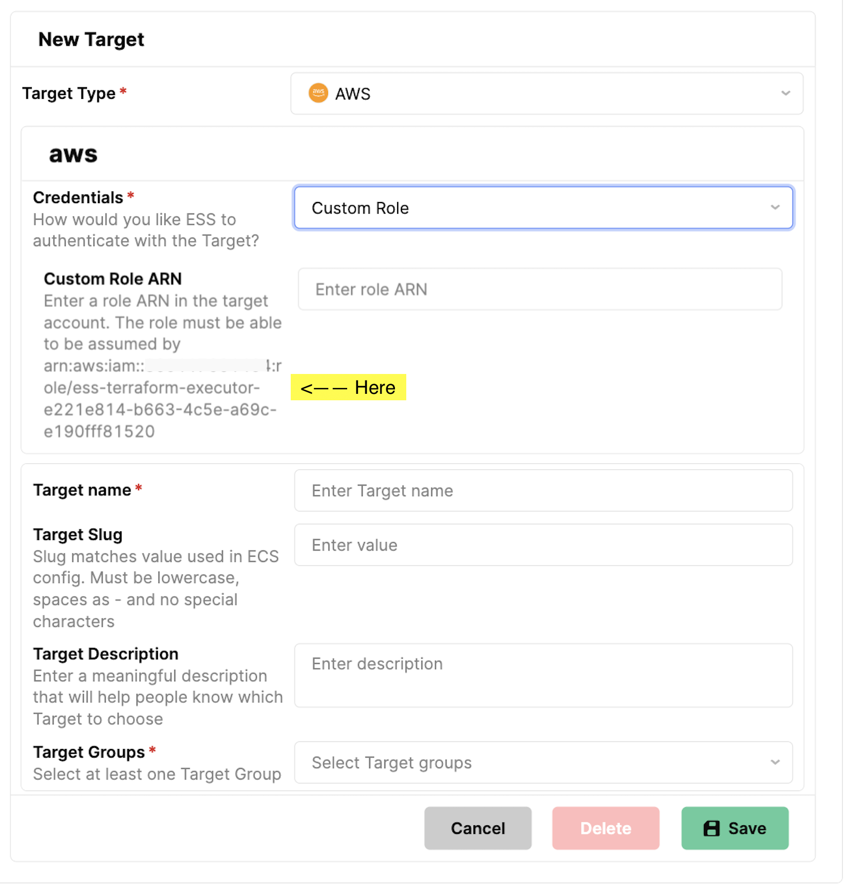

# template-samples-aws-eks-cluster-helm

Use this repository as an ESS Template to deploy a Helm chart with Nginx resource on a Kubernetes cluster, the first thing you need to do is create an ESS Target for the cluster you wish to deploy to. 

Create the Target by selecting Kubernetes and select AWS EKS, GCP GKE or Other (this covers Azure AKS) as credentials type.

Depending on the cluster, the details you need to create the Target will differ. 

## AWS EKS

You will need:

- The cluster endpoint URL from the AWS EKS console
- The Certificate authority from the AWS EKS console
- A role that has permissions to manage the cluster. This role must be able to be assumed by your ESS Organizations executor role which can be found by creating an AWS Target with Custom Role credentials type. See below:



## GCP GKE

- Obtain the contents of the GCP auth config file
- Obtain the cluster CA certificate

## Other Kubernetes (Including Azure AKS)

You will need the following as text:

- Client Certificate
- Client key
- Cluster CA Certificate

## Using Your Cluster Target

You will see from the code in this repository, when you select Kubernetes as Target type, we initialize both the Kubernetes and Helm providers and make them available to your Terraform code. You can choose to deploy using K8s or Helm, and as in this example, if you deploy with Helm, you can query the cluster for information about the deployed Helm chart. 

This repository allows the use of any Helm chart. If your Helm chart requires values passed in, create a new ESS Template and add variables as per the example below:

```
resource "helm_release" "this" {
  name       = var.chart
  repository = var.repository
  chart      = var.chart
  version    = var.chart_version

  set {
    name  = "replicaCount"
    value = var.replica_count
  }
}

variable "replica_count" {
  type = string
  description = "How many pods do you wish to run"
}

```

